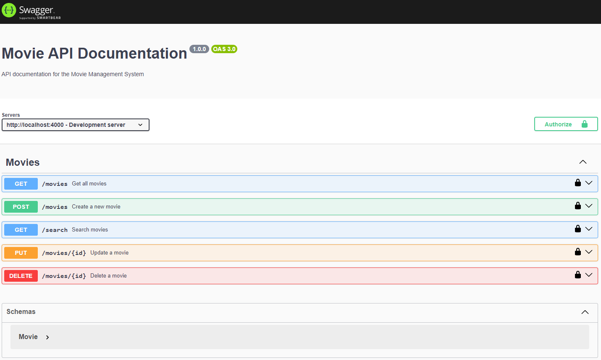

# Movie Lobby API

A RESTful API for managing a movie lobby system. This API allows for creating, reading, updating, and deleting movies with admin authentication.

## Features

- **Create Movie**: Add new movies to the database.
- **Read Movies**: Retrieve a list of all movies.
- **Update Movie**: Modify existing movie details.
- **Delete Movie**: Remove movies from the database.
- **Role-Based Access Control**: Only admin users can create, update, or delete movies.
- **Caching**: Movies are cached in Redis for faster retrieval.
- **Search**: Search movies by title or genre.
- **Swagger Documentation**: API documentation is available at `/api-docs`.

## Setup

1. **Clone the repository**:
   ```bash
   git clone https://github.com/oraykt/movie-lobby-api.git
   cd movie-lobby-api
   ```

2. **Install dependencies**:
   ```bash
   npm install
   ```

3. **Set up environment variables**:
   Create a `.env` file in the root directory and add the following:
   ```
    MONGODB_CERT_URI=
    MONGODB_CERT_PATH=
    MONGODB_CERT_AUTH= # Set to 1 for certificate authentication, 0 for username/password
    MONGODB_AUTH_URI=
    MONGODB_USER=
    MONGODB_PASSWORD=
    REDIS_HOST=
    REDIS_PORT=
    REDIS_USERNAME=default
    REDIS_PASSWORD=
   ```

4. **Start the server**:
   ```bash
   npm start
   ```

5. **Run tests**:
   ```bash
   npm test
   ```

## API Endpoints

### Swagger Documentation

- **URL**: `/api-docs`
- **Method**: `GET`
- **Description**: Access the Swagger UI for API documentation.


### Create a Movie

- **URL**: `/movies`
- **Method**: `POST`
- **Headers**: 
  - `x-user-role`: `admin`
- **Request Body**:
  ```json
  {
    "title": "Inception",
    "genre": "Sci-Fi",
    "rating": 9.0,
    "streamingLink": "https://example.com/inception"
  }
  ```
- **Success Response**:
  - **Code**: `201 CREATED`
  - **Content**: 
    ```json
    {
      "id": "60d5f9f5f9f5f9f5f9f5f9f5",
      "title": "Inception",
      "genre": "Sci-Fi",
      "rating": 9.0,
      "streamingLink": "https://example.com/inception"
    }
    ```

### Get All Movies

- **URL**: `/movies`
- **Method**: `GET`
- **Success Response**:
  - **Code**: `200 OK`
  - **Content**: 
    ```json
    [
      {
        "id": "60d5f9f5f9f5f9f5f9f5f9f5",
        "title": "Inception",
        "genre": "Sci-Fi",
        "rating": 9.0,
        "streamingLink": "https://example.com/inception"
      }
    ]
    ```

### Update a Movie

- **URL**: `/movies/:id`
- **Method**: `PUT`
- **Headers**: 
  - `x-user-role`: `admin`
- **Request Body**:
  ```json
  {
    "title": "Inception Updated",
    "rating": 9.5
  }
  ```
- **Success Response**:
  - **Code**: `200 OK`
  - **Content**: 
    ```json
    {
      "id": "60d5f9f5f9f5f9f5f9f5f9f5",
      "title": "Inception Updated",
      "genre": "Sci-Fi",
      "rating": 9.5,
      "streamingLink": "https://example.com/inception"
    }
    ```

### Search Movies

- **URL**: `/search`
- **Method**: `GET`
- **Query Parameters**:
  - `title`: (optional) Filter by movie title
  - `genre`: (optional) Filter by movie genre
- **Success Response**:
  - **Code**: `200 OK`
  - **Content**: 
    ```json
    [
      {
        "id": "60d5f9f5f9f5f9f5f9f5f9f5",
        "title": "Inception",
        "genre": "Sci-Fi",
        "rating": 9.0,
        "streamingLink": "https://example.com/inception"
      }
    ]
    ```

### Delete a Movie

- **URL**: `/movies/:id`
- **Method**: `DELETE`
- **Headers**: 
  - `x-user-role`: `admin`
- **Success Response**:
  - **Code**: `200 OK`
  - **Content**: 
    ```json
    {
      "message": "Movie deleted successfully"
    }
    ```

#### Application Logs

```text
Server is running on port 4000
Connected to Redis
Connected to MongoDB
GET /movies - Query: {}
Fetching movies from database
GET /movies - Query: {}
Returning cached movies
POST /movies - Body: {"title":"a title","genre":"genre-1","rating":7}
PUT /movies/676dfc0f5cd606471a0826dd - Body: {"title":"new title","genre":"genre-1","rating":7}
GET /movies - Query: {}
Fetching movies from database
DELETE /movies/676dfaaab5c04147a01ebb78
GET /search - Query: {"q":"genre-1"}
Searching movies with query: {}
GET /movies - Query: {}
Fetching movies from database
GET /movies - Query: {}
Returning cached movies
```

#### Test Logs

```text
Movie API
    √ should create a new movie (3822 ms)                                                                                                                                                 
    √ should get all movies (827 ms)                                                                                                                                                      
    √ should update a movie (1195 ms)                                                                                                                                                     
    √ should delete a movie (1041 ms)                                                                                                                                                     
    √ should not allow non-admin to create a movie (271 ms)                                                                                                                               
    √ should cache movie data in Redis (990 ms)                                                                                                                                           
    √ should invalidate cache after movie deletion (1138 ms)                                                                                                                              
      
Test Suites: 1 passed, 1 total                                                                                                                                                            
Tests:       7 passed, 7 total
```

## Technologies Used

- **Node.js**: JavaScript runtime
- **Express.js**: Web framework for Node.js
- **MongoDB**: NoSQL database
- **Mongoose**: MongoDB object modeling tool
- **Jest**: Testing framework
- **Supertest**: HTTP assertions for testing
- **ioredis**: Redis client for Node.js
